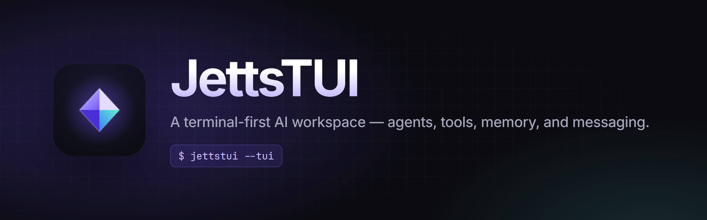
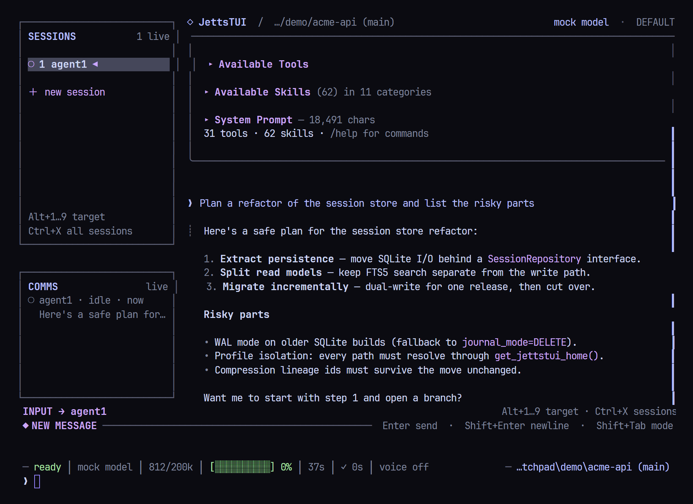
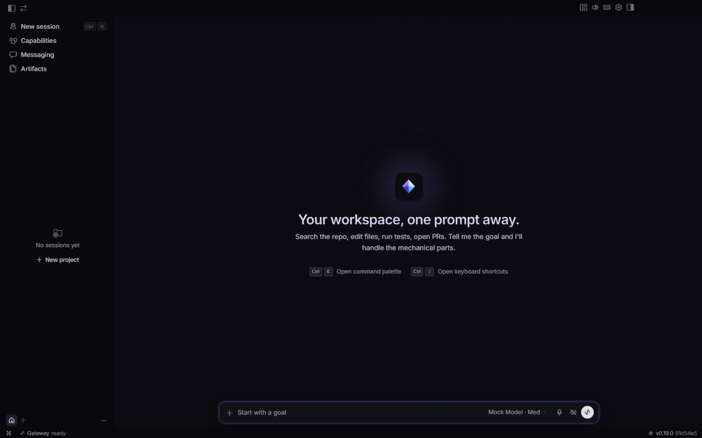
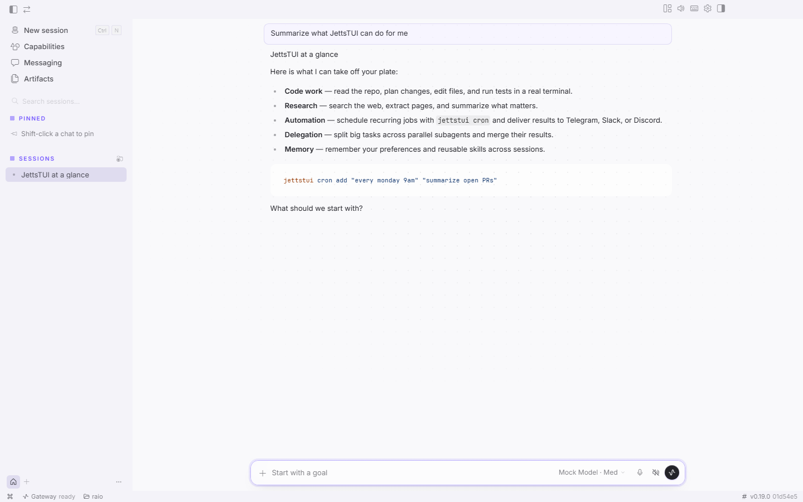

<p align="center">
  
</p>

<p align="center">
  <b>A terminal-first AI workspace.</b> One agent runtime behind a full-screen TUI, a native desktop app, and your messaging apps — with tools, memory, skills, subagents, and scheduled jobs.
</p>

<p align="center">
  <a href="LICENSE"></a>
  
  
</p>

---

<p align="center">
  
  <br><sub>The full-screen terminal UI</sub>
</p>

<p align="center">
  
  <br><sub>The desktop app</sub>
</p>

## Why JettsTUI

| | |
| --- | --- |
| **A real terminal interface** | Full-screen TUI with multiline editing, slash-command autocomplete, session history, interrupt-and-redirect, and streaming tool output. |
| **A native desktop app** | Electron app with a chat transcript, file previews, review pane, integrated terminal, and command palette — on the same runtime as the TUI. |
| **Bring any model** | Pick a provider or any OpenAI-compatible endpoint with `jettstui model`. Model lists are discovered from the provider. |
| **Lives where you do** | One gateway for Telegram, Discord, Slack, WhatsApp, Signal, Matrix, email, and more, with conversation continuity across them. |
| **Learns as it works** | Agent-curated memory, skills it can create and refine, and full-text search over past sessions. |
| **Delegates and schedules** | Spawn isolated subagents for parallel work, and run natural-language cron jobs that deliver to any connected platform. |
| **Runs anywhere** | Local, Docker, SSH, Singularity, Modal, and Daytona terminal backends. |

## Install

Clone the repository and run the setup script for your platform. It creates a virtual environment, puts `jettstui` on your `PATH`, syncs the bundled skills, and opens the provider wizard.

**Linux, macOS, or WSL2**

```bash
git clone https://github.com/Raioshok/JETTS-TUI.git
cd JETTS-TUI
bash setup-jetts-tui.sh
```

**Windows (PowerShell)**

```powershell
git clone https://github.com/Raioshok/JETTS-TUI.git
cd JETTS-TUI
powershell -NoProfile -ExecutionPolicy Bypass -File .\setup-jetts-tui.ps1
```

Pass `--skip-setup` (`-SkipSetup` on Windows) to postpone the wizard, or `--recreate` (`-Recreate`) to rebuild the virtual environment. More options — Nix, Termux, Docker — are in [docs/getting-started](docs/getting-started/installation.md).

> [!NOTE]
> JettsTUI manages Python with Astral's [`uv`](https://github.com/astral-sh/uv). If antivirus software quarantines `uv.exe`, verify the binary against its GitHub release attestation (`gh attestation verify <zip> --repo astral-sh/uv`) before restoring it.

## Quick start

```bash
jettstui              # start the full-screen terminal UI
jettstui model        # choose a provider and model
jettstui tools        # enable or disable toolsets
jettstui setup        # run the complete setup wizard
jettstui gateway      # start the messaging gateway
jettstui desktop      # launch the desktop app
jettstui doctor       # diagnose configuration problems
jettstui update       # update to the latest version
```

`jetts-tui` is installed as an alias of `jettstui`.

Configuration lives in `~/.jettstui/config.yaml` (`%LOCALAPPDATA%\jettstui` on Windows); API keys live in the `.env` file beside it. Profiles (`jettstui -p <name>`) give you fully isolated instances with their own config, memory, and sessions.

### Common commands inside a conversation

| Action | TUI | Messaging platforms |
| --- | --- | --- |
| Start a fresh conversation | `/new` | `/new` |
| Change model | `/model [provider:model]` | `/model [provider:model]` |
| Set a personality | `/personality [name]` | `/personality [name]` |
| Retry or undo the last turn | `/retry`, `/undo` | `/retry`, `/undo` |
| Compress context / check usage | `/compress`, `/usage` | `/compress`, `/usage` |
| Run a skill | `/<skill-name>` | `/<skill-name>` |
| Interrupt current work | `Ctrl+C` or send a new message | `/stop` or send a new message |

## Desktop app

The desktop app lives in [`apps/desktop`](apps/desktop). It starts a headless `jettstui serve` backend and talks to it over JSON-RPC, so it shares sessions, skills, and memory with the TUI.

<p align="center">
  
</p>

```bash
npm ci                     # from the repository root
cd apps/desktop
npm run dev                # Vite renderer + Electron with hot reload
npm run builder            # package an installer for the current OS
```

## Docker

```bash
docker compose up -d       # builds jetts-tui:local and mounts ~/.jettstui
```

Published images are available at `ghcr.io/raioshok/jetts-tui`. See [docs/user-guide/docker.md](docs/user-guide/docker.md) for volumes, profiles, and the dashboard service.

## Migrating from OpenClaw

`jettstui claw migrate` imports your persona, memories, skills, allowlists, messaging settings, and allowlisted API keys. Add `--dry-run` to preview or `--preset user-data` to skip secrets. The setup wizard offers this automatically when it finds `~/.openclaw`.

## Documentation

- [Getting started](docs/getting-started) — installation, quick start, updating
- [User guide](docs/user-guide) — features, messaging platforms, skills, security
- [Developer guide](docs/developer-guide) — architecture, plugins, providers
- [Reference](docs/reference) — CLI commands, configuration keys, environment variables

## Contributing

Contributions are welcome — see [CONTRIBUTING.md](CONTRIBUTING.md) for the development setup and PR process, and [SECURITY.md](SECURITY.md) to report a vulnerability.

```bash
bash setup-jetts-tui.sh --skip-setup
uv pip install -e ".[all,dev]"
scripts/run_tests.sh       # always use the wrapper, never bare pytest
```

## License

MIT — see [LICENSE](LICENSE) and [NOTICE](NOTICE). JettsTUI is a derivative of an MIT-licensed upstream project whose copyright notice is preserved in `LICENSE`.
