<p align="center">
  
</p>

<p align="center">
  <b>A terminal-first AI workspace.</b> One agent runtime behind a full-screen TUI, a desktop app, a web dashboard, and your messaging apps — with tools, memory, skills, subagents, and scheduled jobs.
</p>

<p align="center">
  <a href="LICENSE"></a>
  
  
  <a href="https://github.com/Raioshok/JETTS-TUI/wiki"></a>
</p>

<p align="center">
  <a href="#install">Install</a> ·
  <a href="#quick-start">Quick start</a> ·
  <a href="#screenshots">Screenshots</a> ·
  <a href="#features">Features</a> ·
  <a href="#cli-commands">CLI commands</a> ·
  <a href="#slash-commands">Slash commands</a> ·
  <a href="https://github.com/Raioshok/JETTS-TUI/wiki">Wiki</a>
</p>

---

<p align="center">
  
  <br><sub>The full-screen terminal UI</sub>
</p>

## Install

**Linux, macOS, or WSL2**

```bash
git clone https://github.com/Raioshok/JETTS-TUI.git
cd JETTS-TUI
bash setup-jetts-tui.sh
```

**Windows (PowerShell)** — one-line installer:

```powershell
iex (irm https://raw.githubusercontent.com/Raioshok/JETTS-TUI/main/scripts/install.ps1)
```

It installs everything into `%LOCALAPPDATA%\jettstui`, builds the desktop app, and adds **JettsTUI** to the Start menu (searchable from Start) and to your Desktop. Skip the desktop app with `.\install.ps1 -NoDesktop`. To set up a clone you work on instead:

```powershell
git clone https://github.com/Raioshok/JETTS-TUI.git
cd JETTS-TUI
powershell -NoProfile -ExecutionPolicy Bypass -File .\setup-jetts-tui.ps1
```

The setup script creates a virtual environment with [`uv`](https://github.com/astral-sh/uv), puts `jettstui` (and the `jetts-tui` alias) on your `PATH`, syncs the bundled skills, and opens the provider wizard. Pass `--skip-setup` (`-SkipSetup`) to postpone the wizard or `--recreate` (`-Recreate`) to rebuild the environment.

More options — Nix, Termux, Docker, native Windows — are in the [Installation wiki page](https://github.com/Raioshok/JETTS-TUI/wiki/Installation) and [docs/getting-started](docs/getting-started/installation.md).

## Quick start

```bash
jettstui                  # full-screen terminal UI
jettstui model            # choose a provider and model
jettstui tools            # enable or disable toolsets
jettstui setup            # complete setup wizard
jettstui -z "summarize README.md"   # one-shot prompt, prints the answer
jettstui gateway setup    # connect Telegram, Discord, Slack, ...
jettstui gateway start    # run the messaging gateway
jettstui dashboard        # web dashboard on http://127.0.0.1:9119
jettstui desktop          # launch the desktop app
jettstui doctor           # diagnose configuration problems
jettstui update           # update to the latest version
```

Configuration lives in `~/.jettstui/config.yaml` (`%LOCALAPPDATA%\jettstui` on Windows); API keys live in the `.env` file beside it. `jettstui -p <name>` runs a fully isolated profile with its own config, memory, and sessions.

## Screenshots

### Terminal UI

<p align="center"></p>

### Desktop app

<table>
<tr>
<td width="50%"><br><sub>New session — dark theme</sub></td>
<td width="50%">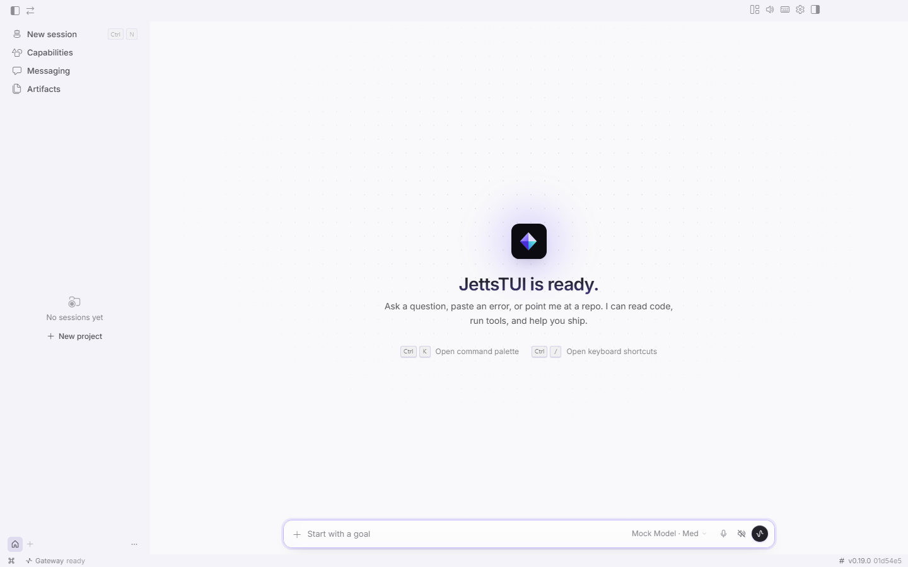<br><sub>New session — light theme</sub></td>
</tr>
<tr>
<td colspan="2"><br><sub>A conversation with tool activity</sub></td>
</tr>
</table>

### Web dashboard

<table>
<tr><td width="50%">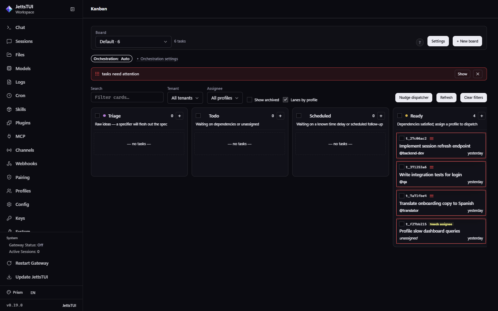<br><sub>Kanban board</sub></td><td width="50%">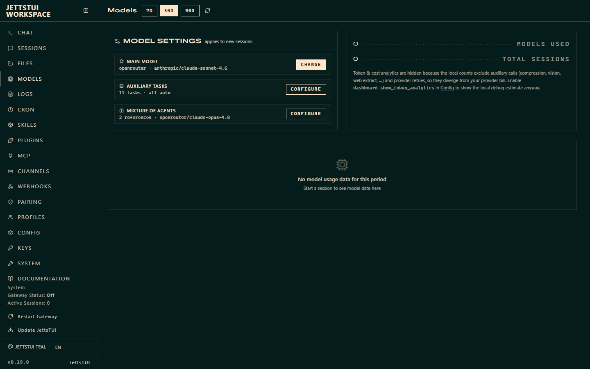<br><sub>Models</sub></td></tr>
<tr><td width="50%">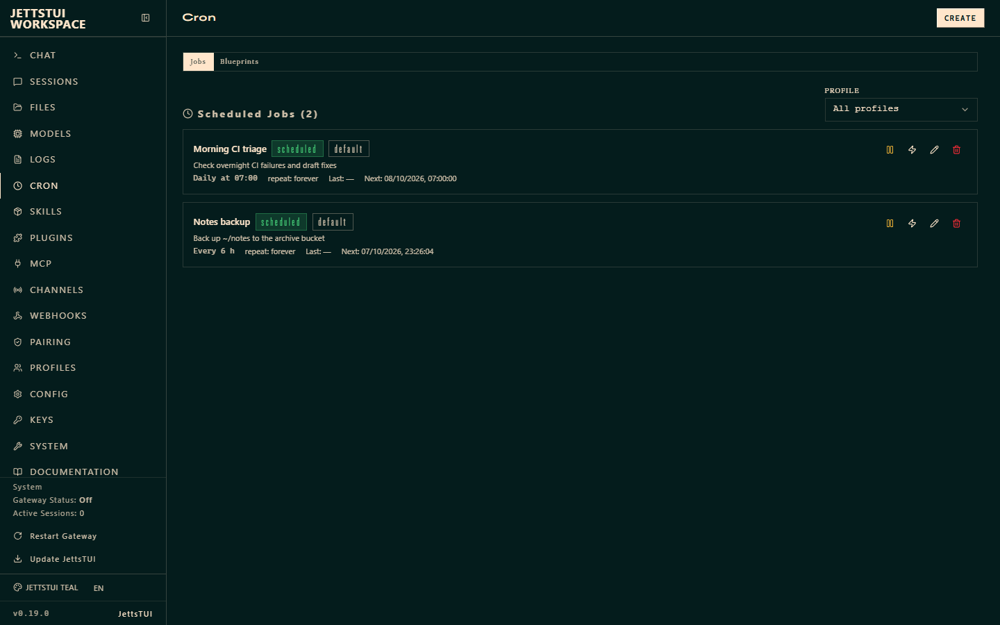<br><sub>Cron jobs</sub></td><td width="50%">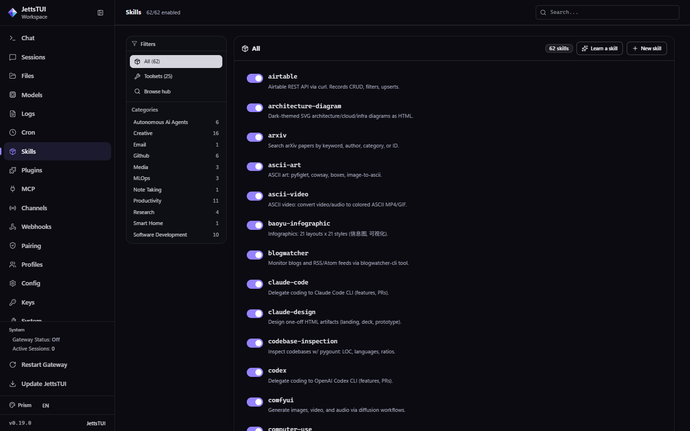<br><sub>Skills</sub></td></tr>
<tr><td width="50%">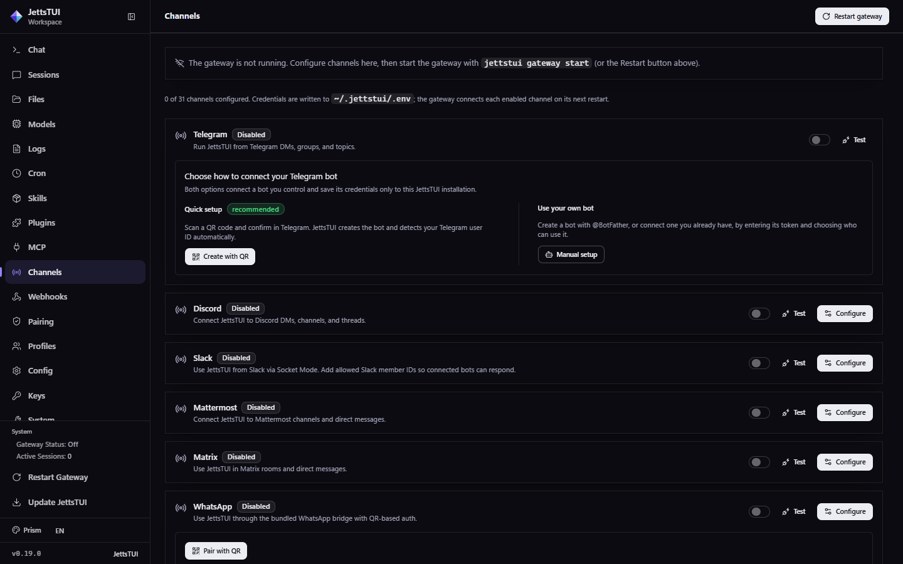<br><sub>Messaging channels</sub></td><td width="50%">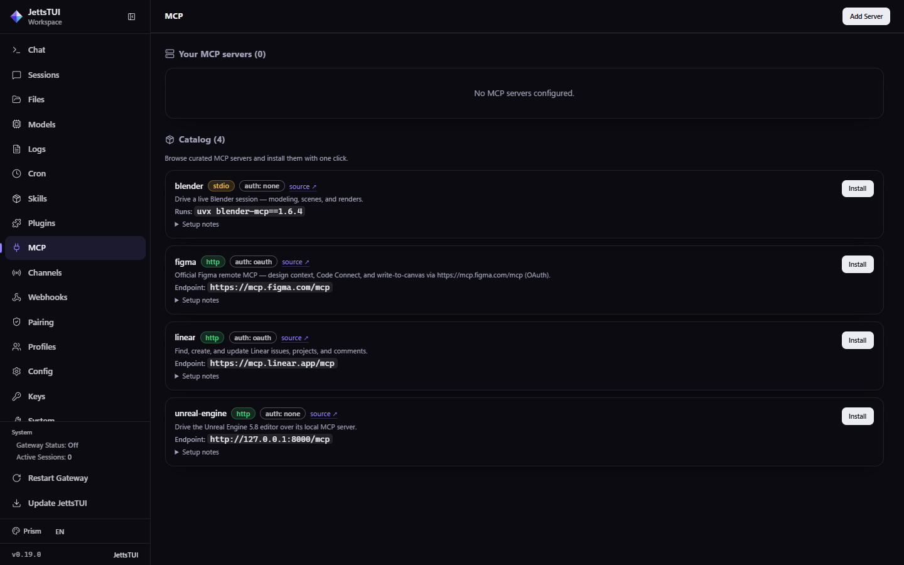<br><sub>MCP servers</sub></td></tr>
<tr><td width="50%">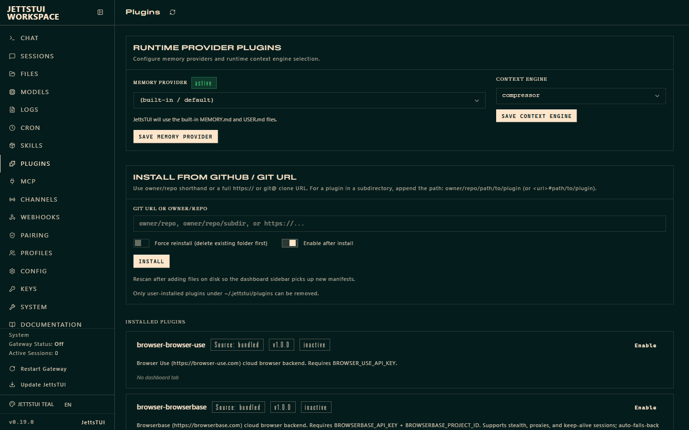<br><sub>Plugins</sub></td><td width="50%">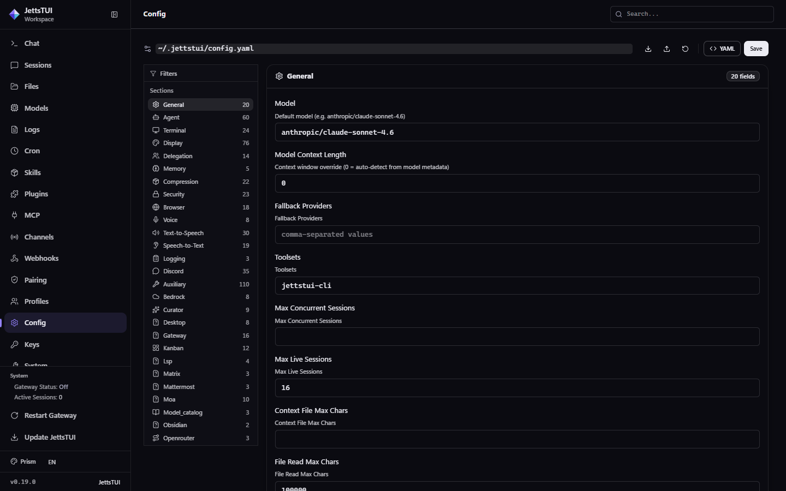<br><sub>Config editor</sub></td></tr>
<tr><td width="50%">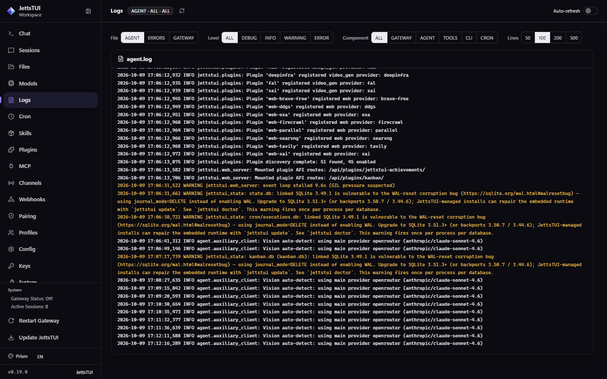<br><sub>Logs</sub></td><td width="50%">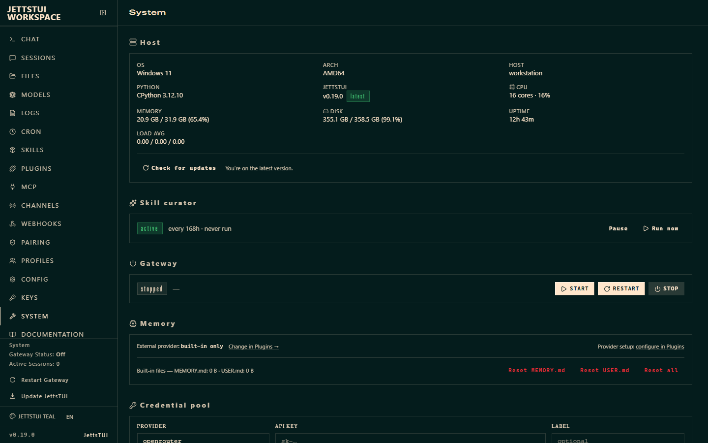<br><sub>System</sub></td></tr>
<tr><td width="50%">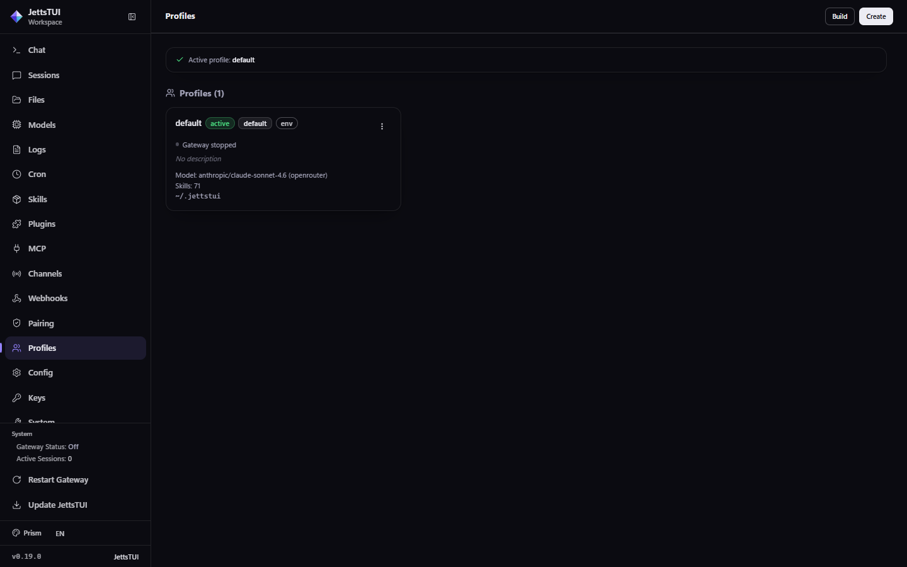<br><sub>Profiles</sub></td><td width="50%">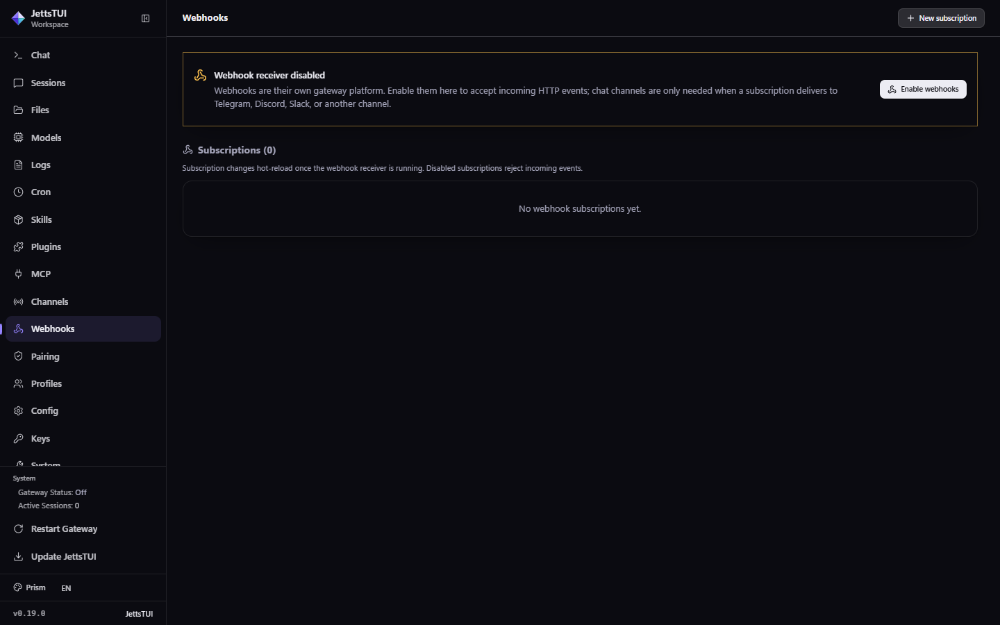<br><sub>Webhooks</sub></td></tr>
</table>

## Features

### Interfaces

- **Full-screen terminal UI** (`jettstui`) — Ink/React TUI with streaming output, multiline composer, slash-command autocomplete, `@file` references, session switcher, live tool activity, approval prompts, and image paste.
- **Classic CLI** (`jettstui chat`) — prompt_toolkit REPL with Rich panels and themed spinners.
- **Desktop app** (`jettstui desktop`, or the Start menu on Windows) — Electron app with a chat transcript, projects, file previews, review pane, integrated terminal, command palette, and light/dark themes.
- **Web dashboard** (`jettstui dashboard`) — browser admin for sessions, models, logs, cron, skills, plugins, MCP, channels, webhooks, pairing, profiles, config, keys, and system health, plus the embedded TUI.
- **Messaging gateway** (`jettstui gateway`) — the same agent on 29 chat platforms with per-chat sessions.
- **Headless backend** (`jettstui serve`) — JSON-RPC/WebSocket server that powers the desktop app and remote clients.
- **Editor integration** (`jettstui acp`) — Agent Client Protocol server for VS Code, Zed, and JetBrains.
- **MCP server mode** (`jettstui mcp serve`) — expose JettsTUI to any MCP host.
- **OpenAI-compatible API server** — call the full agent from any OpenAI SDK.
- **One-shot and scripting** — `jettstui -z "prompt"`, `jettstui chat -q`, `jettstui send`, and a Python library (`AIAgent`).

### Models & providers

- **45 inference providers** built in as plugins, plus any OpenAI-compatible endpoint.
- **Sign-in providers** — ChatGPT/Codex, GitHub Copilot, Qwen, MiniMax, and xAI OAuth flows (`jettstui proxy` exposes them as a local OpenAI-compatible endpoint), plus **Google Antigravity**: sign in with a Google AI Pro / Ultra plan to use Gemini 3 and Claude.
- **Fallback providers** (`jettstui fallback`) tried automatically when the primary model fails.
- **Credential pools** (`jettstui auth`) — rotate several keys per provider with cooldown on rate limits.
- **Mixture of Agents** (`jettstui moa`) — fan a prompt out to reference models and aggregate.
- **Auxiliary models** — pin a separate model per side task (compression, vision, titles, session search, curator).
- **Provider routing, reasoning effort, service tiers, and context-length overrides** per model.
- **Live model discovery** — model lists come from the provider, not a hardcoded table.

### Tools

- **33 toolsets** — terminal, files, web search/extract, browser automation, vision, image and video generation, TTS, code execution, delegation, memory, todo, cron, clarify, session search, Home Assistant, Spotify, Discord, Feishu, and more.
- **Per-platform tool selection** with `jettstui tools` (curses UI) or `config.yaml`.
- **Tool search** — defer rarely-used tool schemas until the model asks for them.
- **Code execution** — Python scripts that call tools programmatically, cutting round-trips.
- **Browser automation** — local Chromium, Browserbase, Browser Use, or Firecrawl backends.
- **Computer use** (`jettstui computer-use`) — background desktop control via cua-driver on macOS, Windows, and Linux.
- **LSP integration** (`jettstui lsp`) — language-server diagnostics after edits.
- **Terminal backends** — Local, Docker, SSH, Modal, Managed Modal, Daytona, Singularity / Apptainer.

### Memory & learning

- **Built-in memory** — agent-curated `MEMORY.md` and `USER.md` that persist across sessions.
- **External memory providers** (`jettstui memory setup`) — Honcho, Mem0, Supermemory, ByteRover, Hindsight, Holographic, OpenViking, RetainDB.
- **Session search** — SQLite FTS5 over every past conversation, with summarization.
- **Skills** — 71 bundled and 111 optional skills; the agent can create and refine its own.
- **Skills hub** (`jettstui skills`) — browse, install, audit, update, publish, and tap skill sources.
- **Skill bundles** (`jettstui bundles`) — one alias that loads several skills.
- **Curator** (`jettstui curator`) — background maintenance that archives stale agent-made skills, with backups and rollback.
- **Journey** (`jettstui journey`) — timeline of learned skills and memories.
- **Project brain** (`jettstui brain`) — Obsidian vault the agent maintains for a project.
- **Context files** — `AGENTS.md`, `CLAUDE.md`, `.cursorrules`, and `SOUL.md` personalities loaded automatically.

### Agents & automation

- **Subagents** — `delegate_task` spawns isolated workers, in parallel batches or in the background; orchestrators can spawn their own workers.
- **Kanban** (`jettstui kanban`) — durable multi-agent board with a dispatcher, profiles as workers, swarms, retries, and a circuit breaker.
- **Cron** (`jettstui cron`) — natural-language or cron-expression schedules, pre-run scripts, job chaining, and delivery to any platform.
- **Webhooks** (`jettstui webhook`) — subscriptions that turn incoming HTTP events into agent runs.
- **Goals and deliverable mode** — long-running objectives with tracked completion.
- **Projects** (`jettstui project`) — named multi-folder workspaces bound to boards.
- **Git worktrees** (`jettstui -w`) — run parallel agents on isolated branches.
- **Checkpoints and rollback** (`jettstui checkpoints`, `/rollback`) — filesystem snapshots before destructive edits.
- **Shell hooks** (`jettstui hooks`) and Python plugin hooks around tool and LLM calls.
- **Spec workflow** — Kiro-style requirements → design → tasks documents.
- **Background processes** with completion notifications.
- **Batch runner** — process prompt datasets in parallel and save trajectories.

### Messaging

- **Platforms** — Telegram, Discord, Slack, WhatsApp (bridge), WhatsApp Business Cloud, Signal, Matrix, Mattermost, Microsoft Teams, Google Chat, Email (IMAP/SMTP), SMS, iMessage (BlueBubbles), Home Assistant, IRC, LINE, ntfy, SimpleX, DingTalk, Feishu / Lark, WeCom, Weixin (WeChat), QQ Bot, Yuanbao, Photon, Raft, Microsoft Graph webhooks, Generic webhooks, OpenAI-compatible API server.
- **DM pairing** (`jettstui pairing`) — approve new users with one-time codes.
- **Profile routing** — send different chats to different profiles.
- **Voice notes, images, and files** in and out; streaming edits where the platform supports them.
- **Telegram topics, Slack threads, and Discord threads** as separate sessions.
- **Service install** (`jettstui gateway install`) — run as a systemd/launchd/Windows service.

### Media

- **Image generation** — OpenAI, OpenAI Codex, OpenRouter, xAI, FAL, Krea, DeepInfra.
- **Video generation and analysis**, **vision**, and **voice mode** (push-to-talk in the TUI).
- **Text-to-speech** (Edge TTS free tier, OpenAI, ElevenLabs, and more) and **speech-to-text** (local Whisper or cloud).
- **Spotify** playback and library control.

### Security

- **Command approvals** — dangerous terminal commands require confirmation; `jettstui approvals suggest` mines history into allowlists.
- **Egress firewall** (`jettstui egress`) — iron-proxy credential injection so secrets never enter the sandbox.
- **Secret sources** (`jettstui secrets`) — Bitwarden and 1Password.
- **Supply-chain audit** (`jettstui security audit`) — OSV.dev scan of the venv, plugins, and MCP servers.
- **Safe mode** (`--safe-mode`), `--ignore-user-config`, `--ignore-rules`, and per-platform tool restrictions.
- **Secret redaction** in logs and tool output; dashboard bound to loopback with session tokens.

### Customization & operations

- **Profiles** (`jettstui profile`, `-p <name>`) — fully isolated instances; export, import, and distribute them.
- **Skins** — studio, default, ares, mono, slate, daylight, warm-lightmode, poseidon, sisyphus, charizard, or your own YAML in `~/.jettstui/skins/`.
- **Pets** (`jettstui pets`) — animated companions in the TUI.
- **17 UI languages** — af, ar, de, en, es, fr, ga, hu, it, ja, ko, pt, ru, tr, uk, zh, zh-hant.
- **Plugins** (`jettstui plugins`) — tools, hooks, CLI commands, dashboard pages, providers, and platforms.
- **MCP client** (`jettstui mcp`) — stdio and HTTP servers with OAuth, plus a one-click catalog.
- **Diagnostics** — `jettstui doctor`, `status`, `logs`, `dump`, `debug share`, `insights`, `prompt-size`.
- **Backup and restore** (`jettstui backup`, `jettstui import`), **OpenClaw migration** (`jettstui claw migrate`), and **self-update** (`jettstui update`).

## CLI commands

Every command accepts `--help`. Full flag reference: [CLI Reference](https://github.com/Raioshok/JETTS-TUI/wiki/CLI-Reference).

### Global flags

| Flag | Description |
| --- | --- |
| `--version, -V` | Show version and exit |
| `-z, --oneshot` | One-shot mode: send a single prompt and print ONLY the final response text to stdout. No banner, no spinner, no tool previews, no session_id line. Tools, memory, rules, and AGENTS.md in the CWD are loaded as normal; approvals are auto-bypassed. Intended for scripts / pipes. |
| `--usage-file` | One-shot mode only: after the run, write a JSON usage report (estimated cost, token counts, model, api_calls) to PATH. The report is written even when the run fails, so pipelines can always account for spend. No effect outside -z/--oneshot. |
| `-m, --model` | Model override for this invocation (e.g. anthropic/claude-sonnet-4.6). Applies to -z/--oneshot and the terminal UI. Also settable via JETTSTUI_INFERENCE_MODEL env var. |
| `--provider` | Provider override for this invocation (e.g. openrouter, anthropic). Applies to -z/--oneshot and the terminal UI. The persistent provider lives in config.yaml under model.provider — use `jettstui setup` or edit the file to change it. |
| `-t, --toolsets` | Comma-separated toolsets to enable for this invocation. Applies to -z/--oneshot and the terminal UI. |
| `--resume, -r` | Resume a previous session by ID or title |
| `--no-restore-cwd` | Don't cd into a resumed session's recorded working directory. |
| `--continue, -c` | Resume a session by name, or the most recent if no name given |
| `--worktree, -w` | Run in an isolated git worktree (for parallel agents) |
| `--accept-hooks` | Auto-approve any unseen shell hooks declared in config.yaml without a TTY prompt.  Equivalent to JETTSTUI_ACCEPT_HOOKS=1 or hooks_auto_accept: true in config.yaml.  Use on CI / headless runs that can't prompt. |
| `--skills, -s` | Preload one or more skills for the session (repeat flag or comma-separate) |
| `--yolo` | Bypass all dangerous command approval prompts (use at your own risk) |
| `--pass-session-id` | Include the session ID in the agent's system prompt |
| `--ignore-user-config` | Ignore ~/.jettstui/config.yaml and fall back to built-in defaults (credentials in .env are still loaded) |
| `--ignore-rules` | Skip auto-injection of AGENTS.md, SOUL.md, .cursorrules, memory, and preloaded skills |
| `--safe-mode` | Troubleshooting mode: disable ALL customizations — user config, AGENTS.md/memory injection, plugins, and MCP servers (implies --ignore-user-config and --ignore-rules) |
| `--tui` | Launch the terminal UI (default; retained for compatibility) |
| `--dev` | Run TUI TypeScript sources via tsx (skip dist build) |
| `-p, --profile <name>` | Run against a named profile (isolated config, memory, sessions). |

### Commands

| Command | Subcommands | Description |
| --- | --- | --- |
| `jettstui chat` | — | Interactive chat with the agent |
| `jettstui model` | — | Select default model and provider |
| `jettstui moa` | `list`, `configure`, `delete` | Configure Mixture of Agents provider/model slots |
| `jettstui fallback` | `list`, `add`, `remove`, `clear` | Manage fallback providers (tried when the primary model fails) |
| `jettstui secrets` | `bitwarden`, `onepassword` | Manage external secret sources (Bitwarden, 1Password) |
| `jettstui egress` | `install`, `setup`, `start`, `stop`, `restart`, `reload`, `status`, `disable`, `config` | Manage the iron-proxy egress credential-injection firewall |
| `jettstui migrate` | `xai` | Migrate configuration for retired models or deprecated settings |
| `jettstui gateway` | `run`, `start`, `stop`, `restart`, `status`, `install`, `uninstall`, `list`, `setup`, `migrate-legacy`, `enroll` | Messaging gateway management |
| `jettstui proxy` | `start`, `status`, `providers` | Local OpenAI-compatible proxy to OAuth providers |
| `jettstui lsp` | `status`, `list`, `install`, `install-all`, `restart`, `which` | Language Server Protocol management |
| `jettstui setup` | — | Interactive setup wizard |
| `jettstui whatsapp` | — | Set up WhatsApp integration |
| `jettstui whatsapp-cloud` | — | Set up WhatsApp Business Cloud API integration |
| `jettstui slack` | `manifest` | Slack integration helpers (manifest generation, etc.) |
| `jettstui send` | — | Send a message to a configured platform (scripts, cron jobs, CI). |
| `jettstui logout` | — | Clear authentication for an inference provider |
| `jettstui auth` | `add`, `list`, `remove`, `reset`, `status`, `logout`, `spotify` | Manage pooled provider credentials |
| `jettstui status` | — | Show status of all components |
| `jettstui cron` | `list`, `create`, `edit`, `pause`, `resume`, `run`, `remove`, `status`, `runs`, `tick` | Cron job management |
| `jettstui webhook` | `subscribe`, `list`, `remove`, `test` | Manage dynamic webhook subscriptions |
| `jettstui kanban` | `init`, `boards`, `create`, `swarm`, `list`, `show`, `assign`, `set-model`, `reclaim`, `reassign`, `diagnostics`, `link`, `unlink`, `claim`, `comment`, `attach`, `attachments`, `attach-rm`, `complete`, `edit`, `block`, `schedule`, `unblock`, `promote`, `archive`, `tail`, `dispatch`, `daemon`, `watch`, `stats`, `notify-subscribe`, `notify-list`, `notify-unsubscribe`, `log`, `runs`, `heartbeat`, `assignees`, `context`, `specify`, `decompose`, `gc`, `repair` | Multi-profile collaboration board (tasks, links, comments) |
| `jettstui project` | `create`, `list`, `show`, `add-folder`, `remove-folder`, `rename`, `set-primary`, `use`, `archive`, `restore`, `bind-board` | Manage projects (named, multi-folder workspaces) |
| `jettstui hooks` | `list`, `test`, `revoke`, `doctor` | Inspect and manage shell-script hooks |
| `jettstui doctor` | — | Check configuration and dependencies |
| `jettstui security` | `audit` | Supply-chain audit (OSV.dev) for venv, plugins, and MCP servers |
| `jettstui approvals` | `suggest` | Approval-prompt tools (mine history into allowlist proposals) |
| `jettstui dump` | — | Dump setup summary for support/debugging |
| `jettstui debug` | `share`, `delete` | Debug tools — upload logs and system info for support |
| `jettstui backup` | — | Back up JettsTUI home directory to a zip file |
| `jettstui checkpoints` | `status`, `list`, `prune`, `clear`, `clear-legacy` | Inspect / prune / clear ~/.jettstui/checkpoints/ |
| `jettstui import` | — | Restore a JettsTUI backup from a zip file |
| `jettstui config` | `show`, `edit`, `get`, `set`, `unset`, `path`, `env-path`, `check`, `migrate` | View and edit configuration |
| `jettstui skin` | `list`, `use`, `set` | List, switch, and tweak skins |
| `jettstui brain` | `init`, `status`, `doctor`, `capture`, `prompt`, `open` | Create and maintain an Obsidian project brain |
| `jettstui console` | — | Open the safe JettsTUI command console |
| `jettstui pairing` | `list`, `approve`, `revoke`, `clear-pending` | Manage DM pairing codes for user authorization |
| `jettstui skills` | `browse`, `search`, `install`, `inspect`, `list`, `check`, `update`, `audit`, `uninstall`, `reset`, `list-modified`, `diff`, `opt-out`, `opt-in`, `repair-official`, `publish`, `snapshot`, `tap`, `config` | Search, install, configure, and manage skills |
| `jettstui bundles` | `list`, `show`, `create`, `delete`, `reload` | Create, list, and manage skill bundles (aliases for multiple skills) |
| `jettstui plugins` | `install`, `update`, `remove`, `list`, `enable`, `disable` | Manage plugins — install, update, remove, list |
| `jettstui curator` | `status`, `usage`, `run`, `pause`, `resume`, `pin`, `unpin`, `list-unmanaged`, `adopt`, `restore`, `list-archived`, `archive`, `prune`, `backup`, `rollback` | Background skill maintenance (curator) — status, run, pause, pin |
| `jettstui pets` | `list`, `install`, `select`, `show`, `off`, `scale`, `remove`, `doctor` | Browse, install, and select petdex animated pets |
| `jettstui journey` (`learning`, `memory-graph`) | `list`, `delete`, `edit` | Timeline of learned skills + memories over time |
| `jettstui memory` | `setup`, `status`, `off`, `reset` | Configure external memory provider |
| `jettstui tools` | `list`, `disable`, `enable`, `post-setup` | Configure which tools are enabled per platform |
| `jettstui computer-use` | `install`, `status`, `doctor`, `permissions` | Manage the Computer Use (cua-driver) backend (macOS/Windows/Linux) |
| `jettstui mcp` | `serve`, `add`, `remove`, `list`, `test`, `configure`, `login`, `reauth`, `picker`, `catalog`, `install` | Manage MCP servers and run JettsTUI as an MCP server |
| `jettstui sessions` | `list`, `export`, `delete`, `prune`, `archive`, `optimize`, `optimize-storage`, `repair`, `recover`, `stats`, `rename`, `retitle-skills`, `browse` | Manage session history (list, rename, export, prune, delete) |
| `jettstui insights` | — | Show usage insights and analytics |
| `jettstui claw` | `migrate`, `cleanup` | OpenClaw migration tools |
| `jettstui version` | — | Show version information |
| `jettstui update` | — | Update JettsTUI Agent to the latest version |
| `jettstui uninstall` | — | Uninstall JettsTUI Agent |
| `jettstui acp` | — | Run JettsTUI Agent as an ACP (Agent Client Protocol) server |
| `jettstui profile` | `list`, `use`, `create`, `delete`, `describe`, `show`, `alias`, `rename`, `export`, `import`, `install`, `update`, `info` | Manage profiles — multiple isolated JettsTUI instances |
| `jettstui completion` | — | Print shell completion script (bash, zsh, or fish) |
| `jettstui dashboard` | — | Start the web UI dashboard |
| `jettstui serve` | — | Start the JettsTUI backend server (headless; powers the desktop app and remote backends) |
| `jettstui desktop` (`gui`) | — | Build and launch the native desktop app |
| `jettstui logs` | — | View and filter JettsTUI log files |
| `jettstui prompt-size` | — | Show a byte breakdown of the system prompt + tool schemas |

## Slash commands

Type these inside a conversation — in the TUI, the desktop app, or any messaging platform. Every installed skill is also available as `/<skill-name>`. **Where** shows whether a command is limited to the terminal or to messaging platforms.

### Session

| Command | Aliases | Where | Description |
| --- | --- | --- | --- |
| `/start` | — | Messaging | Acknowledge platform start pings without a reply |
| `/new [name]` | `/reset` | Everywhere | Start a new session (fresh session ID + history) |
| `/topic [off\|help\|session-id]` | — | Messaging | Enable or inspect Telegram DM topic sessions |
| `/clear` | — | CLI/TUI | Clear screen and start a new session |
| `/redraw` | — | CLI/TUI | Force a full UI repaint (recovers from terminal drift) |
| `/history` | — | CLI/TUI | Show conversation history |
| `/save` | — | CLI/TUI | Save the current conversation |
| `/retry` | — | Everywhere | Retry the last message (resend to agent) |
| `/prompt [initial text]` | `/compose` | CLI/TUI | Compose your next prompt in $EDITOR (markdown), then send it |
| `/undo [N]` | — | Everywhere | Back up N user turns and re-prompt (default 1) |
| `/title [name]` | — | Everywhere | Set a title for the current session |
| `/handoff <platform>` | — | CLI/TUI | Hand off this session to a messaging platform (Telegram, Discord, etc.) |
| `/branch [name]` | `/fork` | Everywhere | Branch the current session (explore a different path) |
| `/compress [here [N] \| focus topic \| --preview\|--dry-run]` | `/compact` | Everywhere | Compress conversation context (add 'here [N]' to keep recent N turns; --preview shows what would happen) |
| `/rollback [number]` | — | Everywhere | List or restore filesystem checkpoints |
| `/snapshot [create\|restore <id>\|prune]` | `/snap` | CLI/TUI | Create or restore state snapshots of JettsTUI config/state |
| `/stop` | — | Everywhere | Kill all running background processes |
| `/approve [session\|always]` | — | Messaging | Approve a pending dangerous command |
| `/deny [all] [reason]` | — | Messaging | Deny a pending dangerous command (optionally with a reason) |
| `/background <prompt>` | `/bg`, `/btw` | Everywhere | Run a prompt in the background |
| `/agents` | `/tasks` | Everywhere | Show active agents and running tasks |
| `/journey [list\|delete <id>\|edit <id>]` | `/learning`, `/memory-graph` | CLI/TUI | Open the learning journey timeline |
| `/queue <prompt>` | `/q` | Everywhere | Queue a prompt for the next turn (doesn't interrupt) |
| `/steer <prompt>` | — | Everywhere | Inject a message after the next tool call without interrupting |
| `/goal [text \| draft <text> \| show \| pause \| resume \| clear \| status \| wait <pid> \| unwait]` | — | Everywhere | Set a standing goal JettsTUI works on across turns until achieved |
| `/spec [list\|new <feature>\|quick <feature>\|status <name>\|approve <name> <stage>\|implement <name>]` | — | CLI/TUI | Create and approve a Kiro-style requirements/design/tasks spec |
| `/moa <prompt>` | — | Everywhere | Run one prompt through the default Mixture of Agents preset, then restore your model |
| `/subgoal [text \| remove N \| clear]` | — | Everywhere | Add or manage extra criteria on the active goal |
| `/status` | — | Everywhere | Show session, model, token, and context info |
| `/permissions` | `/perms` | Everywhere | Show current authority, work mode, approvals, and writable boundaries |
| `/review [unstaged\|staged\|all\|base <branch>\|commit <sha>]` | — | Everywhere | Review git changes without editing files |
| `/doctor [quick\|full]` | — | Everywhere | Run a quick JettsTUI setup and runtime health check |
| `/egress [status]` | — | Everywhere | Show Docker egress proxy status |
| `/context [all]` | `/ctx` | Everywhere | Show detailed context window view with usage gauge, category breakdown, compression stats, and throughput |
| `/sethome` | `/set-home` | Messaging | Set this chat as the home channel |
| `/resume [name]` | — | Everywhere | Resume a previously-named session |
| `/sessions` | — | Everywhere | Browse and resume previous sessions |
| `/restart` | — | Messaging | Gracefully restart the gateway after draining active runs |

### Configuration

| Command | Aliases | Where | Description |
| --- | --- | --- | --- |
| `/config` | — | CLI/TUI | Show current configuration |
| `/model [model] [--provider name] [--global\|--session] [--refresh]` | — | Everywhere | Switch model (session-scoped; --global to persist) |
| `/codex-runtime [auto\|codex_app_server]` | `/codex_runtime` | Everywhere | Toggle codex app-server runtime for OpenAI/Codex models |
| `/personality [name]` | — | Everywhere | Set a predefined personality |
| `/statusbar` | `/sb` | CLI/TUI | Toggle the context/model status bar |
| `/battery [on\|off\|status]` | — | CLI/TUI | Toggle a color-coded battery indicator in the status bar |
| `/timestamps [on\|off\|status]` | `/ts` | CLI/TUI | Toggle [HH:MM] timestamps on messages and /history |
| `/verbose` | — | CLI/TUI | Cycle tool progress display: off -> new -> all -> verbose -> log |
| `/focus [on\|off\|status]` | — | CLI/TUI | Toggle focus view — show only your prompt and the final response |
| `/footer [on\|off\|status]` | — | Everywhere | Toggle gateway runtime-metadata footer on final replies |
| `/yolo` | — | Everywhere | Toggle YOLO mode (skip all dangerous command approvals) |
| `/approvals [manual\|smart\|off]` | — | Everywhere | Show or set the persistent dangerous-command approval mode |
| `/mode [default\|plan\|accept-edits]` | — | CLI/TUI | Switch session work mode: default, plan, or accept-edits |
| `/reasoning [level\|show\|hide\|full\|clamp] [--global]` | — | Everywhere | Manage reasoning effort and display |
| `/fast [normal\|fast\|status] [--global]` | — | Everywhere | Toggle fast mode — OpenAI Priority Processing / Anthropic Fast Mode (Normal/Fast) |
| `/skin [name]` | — | CLI/TUI | Show or change the display skin/theme |
| `/indicator [kaomoji\|emoji\|unicode\|ascii]` | — | CLI/TUI | Pick the TUI busy-indicator style |
| `/voice [on\|off\|tts\|status]` | — | Everywhere | Toggle voice mode |
| `/busy [queue\|steer\|interrupt\|status]` | — | CLI/TUI | Control what Enter does while JettsTUI is working |

### Tools & Skills

| Command | Aliases | Where | Description |
| --- | --- | --- | --- |
| `/tools [list\|disable\|enable] [name...]` | — | CLI/TUI | Manage tools: /tools [list\|disable\|enable] [name...] |
| `/toolsets` | — | CLI/TUI | List available toolsets |
| `/skills` | — | CLI/TUI | Search, install, inspect, or manage skills |
| `/memory [pending\|approve\|reject\|approval] [id\|on\|off]` | — | Everywhere | Review pending memory writes / toggle the approval gate |
| `/bundles` | — | Everywhere | List skill bundles (aliases /<name> for multiple skills) |
| `/pet [toggle\|list\|scale <n>\|<slug>]` | — | CLI/TUI | Toggle or adopt a petdex mascot (/pet, /pet list, /pet <slug>) |
| `/hatch [description]` | `/generate-pet` | CLI/TUI | Generate a new petdex pet from a description |
| `/learn <what to learn from>` | — | Everywhere | Learn a reusable skill from anything you describe (dirs, URLs, this chat, notes) |
| `/brain [init\|status\|capture\|sync\|improve\|doctor\|open] ...` | — | CLI/TUI | Create and maintain an Obsidian project brain |
| `/init [notes]` | — | Everywhere | Generate or update AGENTS.md project instructions from a repo scan |
| `/cron [subcommand]` | — | CLI/TUI | Manage scheduled tasks |
| `/suggestions [accept\|dismiss N \| catalog]` | `/suggest` | Everywhere | Review suggested automations (accept/dismiss) |
| `/blueprint [name] [slot=value ...]` | `/bp` | Everywhere | Set up an automation from a blueprint template |
| `/curator [subcommand]` | — | Everywhere | Background skill maintenance (status, run, pin, archive, list-archived) |
| `/kanban [subcommand]` | — | Everywhere | Multi-profile collaboration board (tasks, links, comments) |
| `/reload` | — | CLI/TUI | Reload .env variables into the running session |
| `/reload-mcp` | `/reload_mcp` | Everywhere | Reload MCP servers from config |
| `/reload-skills` | `/reload_skills` | Everywhere | Re-scan ~/.jettstui/skills/ for newly installed or removed skills |
| `/browser [connect\|disconnect\|status]` | — | CLI/TUI | Connect browser tools to your live Chromium-family browser via CDP |
| `/plugins` | — | CLI/TUI | List installed plugins and their status |

### Info

| Command | Aliases | Where | Description |
| --- | --- | --- | --- |
| `/whoami` | — | Everywhere | Show your slash command access (admin / user) |
| `/profile` | — | Everywhere | Show active profile name and home directory |
| `/diff [staged\|all\|session] [--stat] [path...]` | — | Everywhere | Show git changes in the working directory |
| `/commands [page]` | — | Messaging | Browse all commands and skills (paginated) |
| `/help` | — | Everywhere | Show available commands |
| `/usage [reset [--force]]` | — | Everywhere | Show token usage and rate limits; `reset` redeems a banked Codex limit reset |
| `/insights [days]` | — | Everywhere | Show usage insights and analytics |
| `/platforms` | `/gateway` | CLI/TUI | Show gateway/messaging platform status |
| `/platform <pause\|resume\|list> [name]` | — | Messaging | Pause, resume, or list a failing gateway platform |
| `/copy [number]` | — | CLI/TUI | Copy the last assistant response to clipboard |
| `/paste` | — | CLI/TUI | Attach clipboard image from your clipboard |
| `/image <path>` | — | CLI/TUI | Attach a local image file for your next prompt |
| `/update` | — | Everywhere | Update JettsTUI to the latest version |
| `/version` | `/v` | Everywhere | Show JettsTUI version |
| `/debug [local]` | — | Everywhere | Upload debug report (system info + logs) and get shareable links |

### Exit

| Command | Aliases | Where | Description |
| --- | --- | --- | --- |
| `/quit [--delete]` | `/exit` | CLI/TUI | Exit the CLI (use --delete to also remove session history) |

## Desktop app

The desktop app lives in [`apps/desktop`](apps/desktop). It starts a headless `jettstui serve` backend and talks to it over JSON-RPC, so it shares sessions, skills, and memory with the TUI. On Windows the one-line installer builds it and adds it to the Start menu; elsewhere `jettstui desktop` builds it on first run. Sign-in providers, Google Antigravity included, can be connected from its provider list without a terminal.

```bash
npm ci                     # from the repository root
cd apps/desktop
npm run dev                # Vite renderer + Electron with hot reload
npm run builder            # package an installer for the current OS
```

## Docker

```bash
docker compose up -d       # builds jetts-tui:local and mounts ~/.jettstui
```

Published images are available at `ghcr.io/raioshok/jetts-tui`. See [Docker](docs/user-guide/docker.md) for volumes, profiles, and the dashboard service.

## Documentation

- **[Wiki](https://github.com/Raioshok/JETTS-TUI/wiki)** — guides for every feature, the full CLI and slash-command reference, and troubleshooting
- [Getting started](docs/getting-started) — installation, quick start, updating
- [User guide](docs/user-guide) — features, messaging platforms, skills, security
- [Developer guide](docs/developer-guide) — architecture, plugins, providers
- [Reference](docs/reference) — configuration keys, environment variables, toolsets

## Contributing

Contributions are welcome — see [CONTRIBUTING.md](CONTRIBUTING.md) for the development setup and PR process, and [SECURITY.md](SECURITY.md) to report a vulnerability.

```bash
bash setup-jetts-tui.sh --skip-setup
uv pip install -e ".[all,dev]"
scripts/run_tests.sh       # always use the wrapper, never bare pytest
```

## License

MIT — see [LICENSE](LICENSE) and [NOTICE](NOTICE).
