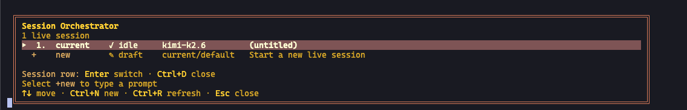

# TUI

The TUI is Jetts-TUI's interactive terminal experience, backed by the Python agent runtime. It combines the agent, sessions, and slash commands in one clean, responsive surface.

It's the recommended way to run Jetts-TUI interactively.

## Launch

```bash
# Launch the TUI
jetts-tui

# Resume the latest TUI session (falls back to the latest classic session)
jetts-tui -c
jetts-tui --continue

# Resume a specific session by ID or title
jetts-tui -r 20260409_000000_aa11bb
jetts-tui --resume "my t0p session"

# Run source directly — skips the prebuild step (for TUI contributors)
jetts-tui --dev
```

The legacy environment switch remains accepted:

```bash
export FREEIDE_TUI=1
jetts-tui          # TUI (already the default)
jetts-tui chat     # same
```

Older configuration files may still contain:

```yaml
display:
  interface: tui   # compatibility key; Ink is the only interactive terminal UI
```

Bare `jetts-tui` and `jetts-tui chat` launch the TUI. Older `display.interface` values and the `--cli` spelling are accepted for configuration and script compatibility, but no longer expose a second interactive interface. Redirected and automated invocations still use the headless Python runner.

The [CLI command guide](cli.md) documents slash commands, quick commands, skill preloading, personalities, multiline input, and interrupts available in this interface.

## Why the TUI

- **Instant first frame** — the banner paints before the app finishes loading, so the terminal never feels frozen while Jetts-TUI is starting.
- **Non-blocking input** — type and queue messages before the session is ready. Your first prompt sends the moment the agent comes online.
- **Rich overlays** — model picker, session picker, approval and clarification prompts all render as modal panels rather than inline flows.
- **Live session panel** — tools and skills fill in progressively as they initialize.
- **Mouse-friendly selection** — drag to highlight with a uniform background instead of SGR inverse. Copy with your terminal's normal copy gesture.
- **Alternate-screen rendering** — differential updates mean no flicker when streaming, no scrollback clutter after you quit.
- **Composer affordances** — inline paste-collapse for long snippets, `Cmd+V` / `Ctrl+V` text paste with clipboard-image fallback, bracketed-paste safety, and image/file-path attachment normalization.

Same [skins](features/skins.md) and [personalities](features/personality.md) apply. Switch mid-session with `/skin ares`, `/personality pirate`, and the UI repaints live. See [Skins & Themes](features/skins.md) for the full list of customizable keys and which ones apply to classic vs TUI — the TUI honors the banner palette, UI colors, prompt glyph/color, session display, completion menu, selection bg, `tool_prefix`, and `help_header`.

### Collapsible banner sections

The TUI startup banner groups runtime info into four collapsible sections, each rendered with a `▸` / `▾` chevron next to the section title:

| Section | Default state |
|---------|---------------|
| Tools | Open |
| Skills | Collapsed |
| System Prompt | Collapsed |
| MCP Servers | Collapsed |

Click anywhere on a section header (or its chevron) to toggle it. The Tools list opens by default because it's the most-checked section at session start; Skills, System Prompt, and MCP Servers collapse by default so the banner stays compact even when you've installed dozens of skills or wired up many MCP servers. State is local to the banner instance, so the next launch resets to the defaults.

## Requirements

- **Node.js** ≥ 20 — the TUI runs as a subprocess launched from the Python CLI. `jetts-tui doctor` verifies this.
- **TTY** — interactive sessions require a terminal. Piped and automated invocations use the headless runner.

On first launch Jetts-TUI installs the TUI's Node dependencies into `ui-tui/node_modules` (one-time, a few seconds). Subsequent launches are fast. If you pull a new Jetts-TUI version, the TUI bundle is rebuilt automatically when sources are newer than the dist.

:::tip Working across git worktrees?
Contributors who run `jetts-tui --tui --dev` from many worktrees can share one `node_modules` instead of installing per checkout — see [TUI & Desktop from Worktrees](../developer-guide/worktree-ui-dev.md).
:::

### External prebuild

Distributions that ship a prebuilt bundle (Nix, system packages) can point Jetts-TUI at it:

```bash
export FREEIDE_TUI_DIR=/path/to/prebuilt/ui-tui
jetts-tui
```

The directory must contain `dist/entry.js`.

## Keybindings

The complete keybinding reference lives in the [CLI guide](cli.md#keybindings). TUI-specific behavior includes:

- **Mouse drag** highlights text with a uniform selection background.
- **`Cmd+V` / `Ctrl+V`** first tries normal text paste, then falls back to OSC52/native clipboard reads, and finally image attach when the clipboard or pasted payload resolves to an image.
- **`/terminal-setup`** installs local VS Code / Cursor / Windsurf terminal bindings for better `Cmd+Enter` and undo/redo parity on macOS.
- **Slash autocompletion** opens as a floating panel with descriptions, not an inline dropdown.
- **`Ctrl+X`** opens the live session switcher. When a queued message is highlighted (sent while the agent was still running), it still deletes that queued message instead. **`Esc`** cancels editing and unhighlights without deleting.
- **`Alt+1` … `Alt+9`** targets the matching live session directly. On wide terminals the numbered targets stay visible in the resident-session sidebar.
- **`Ctrl+G` / `Ctrl+X Ctrl+E`** — open the current input buffer in `$EDITOR` for multi-line / long-prompt composition; save-and-exit sends the contents back as the prompt.

## Slash commands

All slash commands work unchanged. A few are TUI-owned — they produce richer output or render as overlays rather than inline panels:

| Command | TUI behavior |
|---------|--------------|
| `/help` | Overlay with categorized commands, arrow-key navigable |
| `/sessions` (alias `/switch`) | Live session switcher — list open TUI sessions, switch between them, close them, or start another one |
| `/model` | Modal model picker grouped by provider, with cost hints |
| `/skin` | Live preview — theme change applies as you browse |
| `/details` | Toggle verbose tool-call details (global or per-section) |
| `/usage` | Rich token / cost / context panel |
| `/agents` (alias `/tasks`) | Observability overlay — live subagent tree with kill/pause controls, per-branch cost / token / file rollups, turn-by-turn history |
| `/reload` | Re-reads `~/.freeide/.env` into the running TUI process so newly added API keys take effect without a restart |
| `/mouse [on\|off\|toggle\|wheel\|buttons\|all]` | Pick a mouse tracking preset at runtime (also persists to `display.mouse_tracking` in `config.yaml`). `wheel` (1000+1006) keeps scroll-wheel scrolling without the hover events that make tmux spam "No image in clipboard" over the prompt row; `buttons` adds drag-to-select; `all` is the default with hover-driven UI. |

Every other slash command, including installed skills, quick commands, and personality toggles, is available through the shared command registry. See [Slash Commands Reference](../reference/slash-commands.md).

## Live session switcher

Use the live session switcher when you want one terminal to act as a dispatcher for several TUI sessions. It lists only sessions that are currently live in this TUI process; closed sessions remain saved transcripts and can still be reopened with `/resume` or `jetts-tui --resume <id-or-title>`.

Open it with any of these:

- `Ctrl+X` from the TUI.
- `/sessions` or `/switch`.
- `/sessions new` to create a fresh live session immediately.
- Click the `N live sessions` count in the status line.



[Session Orchestrator demo video](../assets/img/docs/tui-session-orchestrator/session-orchestrator-demo.mp4)

Inside the switcher:

- `↑` / `↓` move the selection; mouse clicks select rows too.
- `Enter` switches to the selected live session.
- `Ctrl+D` closes the selected live session.
- `Ctrl+N` starts a blank live session.
- `Ctrl+R` refreshes the live-session list.
- `Esc` closes the switcher.
- Select `+new`, type a prompt, and press `Enter` to dispatch a new live session. Press `Tab` first if you want to choose a model just for that new session.

### Wide resident workspace

At 118 columns and 30 rows or larger, the TUI automatically expands into a multi-session workspace. The left sidebar keeps live sessions and their status visible, the Comms panel shows each session's latest activity, and background sessions remain as compact resident panes above the focused transcript. One composer stays authoritative: the `INPUT →` strip always names its target, so switching sessions never risks sending a prompt to the wrong agent.

Click a session or resident pane to focus it, use `Alt+1` … `Alt+9` for direct targeting, or press `Ctrl+X` for the complete live/resumable session picker. Shrinking the terminal returns to the normal single-transcript layout without closing any live session.

Subagents spawned inside the focused session appear in **CHILD AGENTS** beneath the session list; active children are shown first, and Comms shows their latest activity. Click that section or use `/agents` to inspect and control them. Children are not independent live sessions, so they do not change the `N live` count or get their own `Alt+N` composer target.

For a repeatable busy-input, child-agent, keyboard, and resize check, follow `TUI-SMOKE.md` in the repository root.

While another session runs in the background, its sidebar row shows a `+N` unread badge (a `•` when a resumed session's count reset), and the Comms panel lists the three most recently active sessions with a relative `3m`/`2h` age. Focusing a session clears its badge. Set `display.resident_workspace` in `config.yaml` to `auto` (default), `on` (always when sessions exist), or `off` (never — keep the single-transcript layout) to override the automatic width/height gate.

## LaTeX math rendering

The TUI's markdown pipeline renders LaTeX math inline: `$E = mc^2$` and `$$\frac{a}{b}$$` render as Unicode-formatted math instead of the raw TeX source. Works for inline and block math; unsupported syntax falls back to showing the literal TeX wrapped in a code span so it remains copyable.

This is always on; unsupported syntax remains copyable as literal TeX.

## Light-terminal detection

The TUI auto-detects light terminals and swaps to the light theme accordingly. Detection works in three layers:

1. `FREEIDE_TUI_THEME` env var — highest priority. Values: `light`, `dark`, or a raw 6-char background hex (e.g. `ffffff`, `1a1a2e`).
2. `COLORFGBG` env var — the classic "what's my background color?" hint used by xterm-derived terminals.
3. Terminal background probe via OSC 11 — works on modern terminals (Ghostty, Warp, iTerm2, WezTerm, Kitty) that don't set `COLORFGBG`.

If you want the light theme permanently regardless of terminal:

```bash
export FREEIDE_TUI_THEME=light
```

## Busy indicator styles

The status-bar busy indicator is pluggable — the default rotates Jetts-TUI' kawaii face palette every 2.5 seconds during agent work. Pick a different style via config or the `/indicator` slash command:

```yaml
display:
  tui_status_indicator: kaomoji   # kaomoji | emoji | unicode | ascii
```

Or in-session: `/indicator emoji` (etc.). Styles ship with matched glyph widths so the rest of the status bar doesn't jitter on rotation.

## Auto-resume

By default, `jetts-tui --tui` starts a fresh session each launch. To re-attach to the most recent TUI session automatically (useful when your terminal or SSH connection drops unexpectedly), opt in:

```bash
export FREEIDE_TUI_RESUME=1          # most-recent TUI session
# or:
export FREEIDE_TUI_RESUME=<session-id>   # specific session
```

Unset the variable or pass `--resume <id>` explicitly to override on a per-launch basis.

## Status line

The TUI's status line tracks agent state in real time:

| Status | Meaning |
|--------|---------|
| `starting agent…` | Session ID is live; tools and skills still coming online. You can type — messages queue and send when ready. |
| `ready` | Agent is idle, accepting input. |
| `thinking…` / `running…` | Agent is reasoning or running a tool. |
| `interrupted` | Current turn was cancelled; press Enter to send again. |
| `forging session…` / `resuming…` | Initial connect or `--resume` handshake. |

Status-bar colors and thresholds come from the shared skin system — see [Skins](features/skins.md) for customization.

The status line also shows:

- **Working directory with git branch** — `~/projects/freeide-agent (docs/two-week-gap-sweep)`. The branch suffix updates when you `git checkout` in a side terminal (mtime-cached) so the TUI reflects your actual active branch, not whatever it was at launch.
- **Per-prompt elapsed time** — `⏱ 12s/3m 45s` while the turn is running (live), frozen to `⏲ 32s / 3m 45s` after the turn completes. First number is time since last user message; second is total session duration. Resets on every new prompt.
- **`🗜️ N`** — number of times the running session has been auto-compressed. Appears once the first compression fires.
- **`▶ N`** — number of `/background` tasks currently running in this session. Appears whenever at least one task is in flight.
- **`⚠ YOLO`** — visible warning whenever YOLO mode is on (`jetts-tui --yolo`, `/yolo`, or `FREEIDE_YOLO_MODE=1`). The same badge also appears in the startup banner so you cannot launch an auto-approving session without noticing.

## Configuration

The TUI respects all standard Jetts-TUI config: `~/.freeide/config.yaml`, profiles, personalities, skins, quick commands, credential pools, memory providers, tool/skill enablement. No TUI-specific config file exists.

A handful of keys tune the TUI surface specifically:

```yaml
display:
  skin: default              # any built-in or custom skin
  personality: helpful
  details_mode: collapsed    # hidden | collapsed | expanded — global accordion default
  sections:                  # optional: per-section overrides (any subset)
    thinking: expanded       # always open
    tools: expanded          # always open
    activity: collapsed      # opt back IN to the activity panel (hidden by default)
  mouse_tracking: all        # off | wheel | buttons | all (or true/false for back-compat).
                             #   wheel   — 1000+1006 (scroll + click; no drag, no hover —
                             #             recommended inside tmux to silence the prompt-row
                             #             "No image in clipboard" spam from hover events)
                             #   buttons — adds 1002 for terminal-side drag selection
                             #   all     — adds 1003 for hover (scrollbar paginate-on-hover,
                             #             link mouseenter, etc.)
```

Runtime toggles:

- `/details [hidden|collapsed|expanded|cycle]` — set the global mode
- `/details <section> [hidden|collapsed|expanded|reset]` — override one section
  (sections: `thinking`, `tools`, `subagents`, `activity`)

**Default visibility**

The TUI ships with opinionated per-section defaults that stream the turn as
a live transcript instead of a wall of chevrons:

- `thinking` — **expanded**. Reasoning streams inline as the model emits it.
- `tools` — **expanded**. Tool calls and their results render open.
- `subagents` — falls through to the global `details_mode` (collapsed under
  chevron by default — stays quiet until a delegation actually happens).
- `activity` — **hidden**. Ambient meta (gateway hints, terminal-parity
  nudges, background notifications) is noise for most day-to-day use. Tool
  failures still render inline on the failing tool row; ambient
  errors/warnings surface via a floating-alert backstop when every panel
  is hidden.

Per-section overrides take precedence over both the section default and the
global `details_mode`. To reshape the layout:

- `display.sections.thinking: collapsed` — put thinking back under a chevron
- `display.sections.tools: collapsed` — put tool calls back under a chevron
- `display.sections.activity: collapsed` — opt the activity panel back in
- `/details <section> <mode>` at runtime

Anything set explicitly in `display.sections` wins over the defaults, so
existing configs keep working unchanged.

## Sessions

Sessions are stored in `~/.freeide/state.db`, so terminal, desktop, dashboard, and messaging surfaces can resume the same conversation history. Older sessions may retain a legacy source tag.

See [Sessions](sessions.md) for lifecycle, search, compression, and export.

## How the TUI talks to its gateway

By default the TUI spawns its own in-process gateway, so each TUI instance is self-contained — there's nothing to configure.

You may see a `FREEIDE_TUI_GATEWAY_URL` env var referenced in the codebase or logs. This is an **internal wiring detail of the web dashboard**, not a user-facing remote-attach knob. When you open the dashboard's "Chat" tab (`jetts-tui dashboard` → `/chat`), the dashboard's web server spawns an embedded TUI child process and injects `FREEIDE_TUI_GATEWAY_URL` so that child attaches to the dashboard's own in-process `tui_gateway` over a loopback WebSocket (`/api/ws`). The `/api/ws` endpoint exists only inside the dashboard server (`freeide_cli/web_server.py`) and is bound to that process's lifetime and auth.

There is no general "point any TUI at any standalone gateway port" mode. In particular, the OpenAI-compatible API server (`jetts-tui gateway` / the `api_server` platform) does **not** serve `/api/ws` — it's the model-backend surface (`/v1/chat/completions`, `/v1/models`, …) and deliberately does not expose the TUI's JSON-RPC control channel. Setting `FREEIDE_TUI_GATEWAY_URL` to that port will 404.

If you want multiple surfaces to share one set of sessions, use the shared `~/.freeide/state.db` (see [Sessions](sessions.md)) or the web dashboard's embedded chat (see [Web Dashboard](features/web-dashboard.md#chat)) — not a hand-set gateway URL.

## Compatibility

Launching `jetts-tui` starts the TUI. The `--tui` flag and `FREEIDE_TUI=1` remain supported for older scripts, but are no longer necessary.

If the TUI cannot launch because Node or its bundle is unavailable, Jetts-TUI prints an actionable diagnostic. Run `jetts-tui doctor` to repair the local runtime.

## See also

- [CLI Interface](cli.md) — full slash command and keybinding reference (shared)
- [Sessions](sessions.md) — resume, branch, and history
- [Skins & Themes](features/skins.md) — theme the banner, status bar, and overlays
- [Voice Mode](features/voice-mode.md) — speech input and playback in the TUI
- [Configuration](configuration.md) — all config keys
